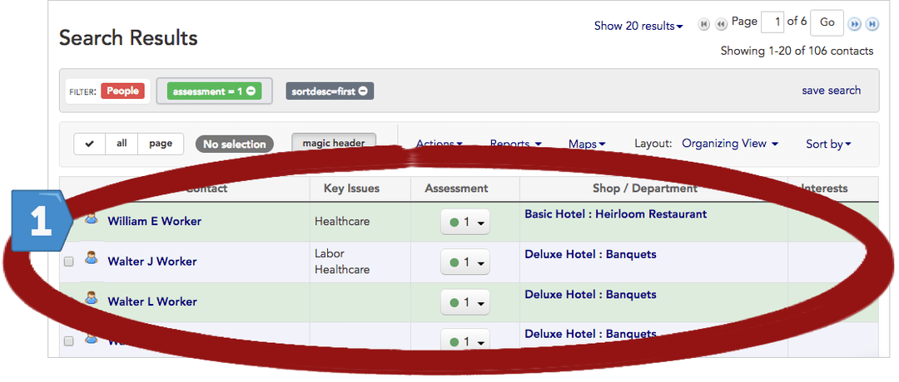
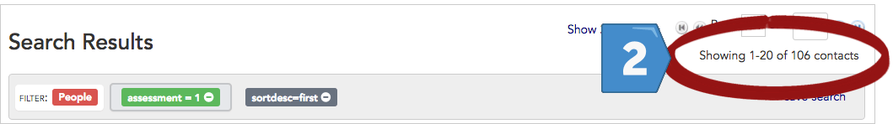
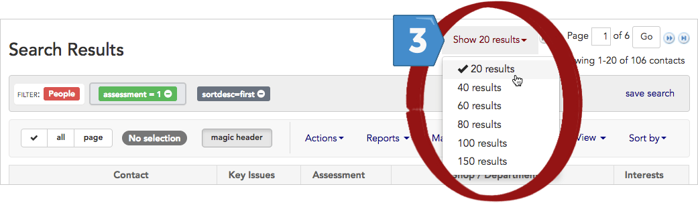
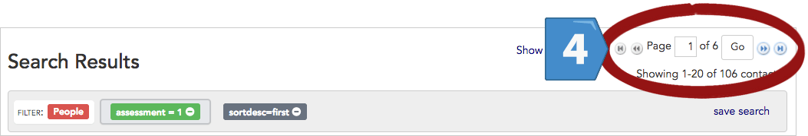
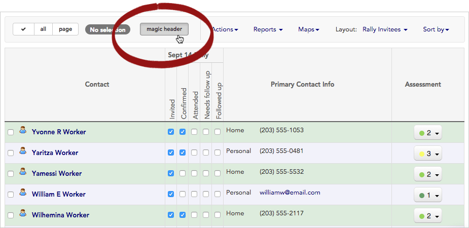
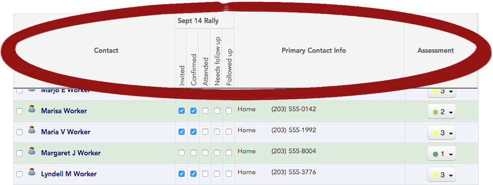
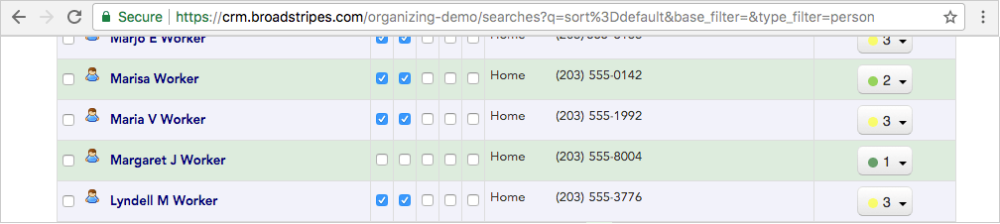

\[et\_pb\_section bb\_built="1" admin\_label="section"\]\[et\_pb\_row admin\_label="row" background\_position="top\_left" background\_repeat="repeat" background\_size="initial" \_builder\_version="3.0.105"\]\[et\_pb\_column type="4\_4"\]\[et\_pb\_text background\_position="top\_left" background\_repeat="repeat" background\_size="initial" \_builder\_version="3.0.106" background\_layout="light"\]

## Overview

Running a search is a great way to narrow down the contact records you're working with – instead of wading through every record in the project, with search results you'll see just the contacts you're interested in.

However, even after running a search, you may still have a large number of contacts included in the results. This article will help you learn to navigate those records.

## The search results page

We'll begin by getting to know the search page. There's a lot of information displayed here. There are also helpful tools for navigating – you just need to know where to look. Below we look at four areas of the search results page.

### 1\. Contacts

\[caption id="attachment\_1720" align="aligncenter" width="1080"\] This section of the search results shows each of the contacts that match the search criteria.\[/caption\]

### 2\. Total number of contacts included in the search results

\[caption id="attachment\_1722" align="aligncenter" width="1059"\] This shows which contacts are currently being displayed (1-20) of the total number of contacts returned in the search (106 contacts).\[/caption\]

### 3\. Contact records shown per page

\[caption id="attachment\_1724" align="aligncenter" width="1041"\] This drop-down menu lets you choose how many records you see on each page. You'll see 20 records per page by default.\[/caption\]

### 4\. Page navigation

\[caption id="attachment\_1727" align="aligncenter" width="1053"\] This shows which page you are currently viewing (page 1) and the total number of pages of search results (6 pages).\[/caption\]

## Scrolling through results

You can **scroll down** through your search results in a few ways:

> - use your keyboard's **down arrow** or **page down key**.
> - use your **mouse** to scroll down, just as you would with any other web page.

As you scroll down, you will notice that Broadstripes **dynamically loads additional records** as you reach the end of your search results. As more records are loaded (20 at a time), the toolbar will adjust its count (for instance "**Showing 1-20 of 106**" will change to "**Showing 1-40 of 106**") so you can always know the total number of contacts being displayed.

You can keep the header information visible even as you scroll down the search results by clicking the "**magic header"** button. This will "lock" the labels in place at the top of the page.

\[caption id="attachment\_1725" align="aligncenter" width="925"\] Click "magic header".\[/caption\]

\[caption id="attachment\_1721" align="aligncenter" width="961"\] With magic header **on**, the header section of the search results stays at the top of the page no matter where you scroll in the results.\[/caption\]

\[caption id="attachment\_1726" align="aligncenter" width="1008"\] With magic header **off,** the header section of the search results vanishes as you scroll down through search results.\[/caption\]

## Paging through results

If you want to move more quickly through your search results, you can view them a page at a time. First, set the number of results you want to see per page using the "**Show 20 results**" drop-down menu at the top of the page.

Next, use the **page navigation tool** that's located at the top and bottom page of your search results to move from page to page.

You can either **type the page number** you want to view and click **Go** to jump there, or use the navigation arrows. Click the  **double arrows** to step forward one page at a time, or click the  **fast forward arrows** to go to the very last page of your search results. (Move backward through your results using the  and  arrows.)

\[/et\_pb\_text\]\[/et\_pb\_column\]\[/et\_pb\_row\]\[/et\_pb\_section\]
