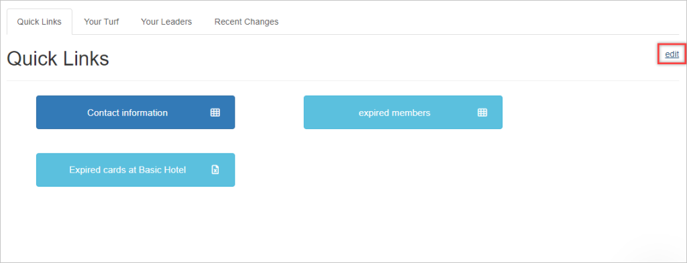
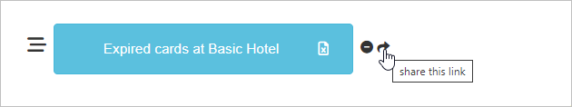
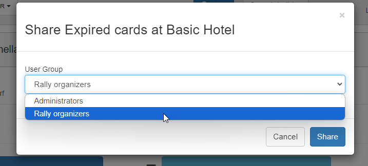

You can easily share quick links to user groups on your Quick Links page.

This guide will walk you through the process of sharing quick links with user groups from your Quick Links page.:

1. To share a quick link, you must first c[reate](https://help.broadstripes.com/help-articles/using-broadstripes/customize/create-a-quick-link/) [it.](https://help.broadstripes.com/help-articles/using-broadstripes/customize/create-a-quick-link/) Once created, you will need to select the edit button on the right of the Quick Links tab.
2. Two icons will appear next to your quick links. Click on the **right-facing arrow** icon. 
3. A dialogue box will appear where you can select the user group with which you want to share the quick link. Select the appropriate user group. 
4. Click the Share button.

Once shared, the quick link will be available on the Quick Links page for all members of the selected user group.
