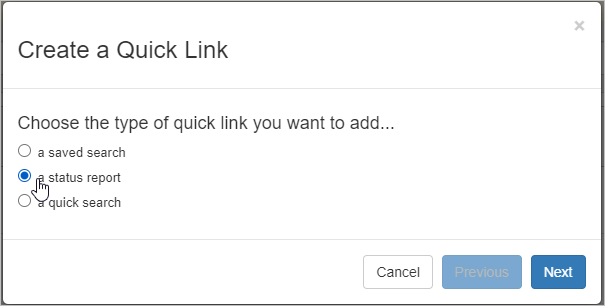
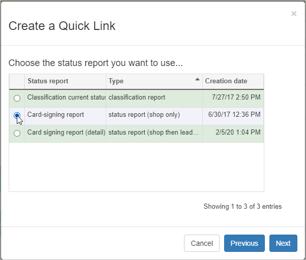
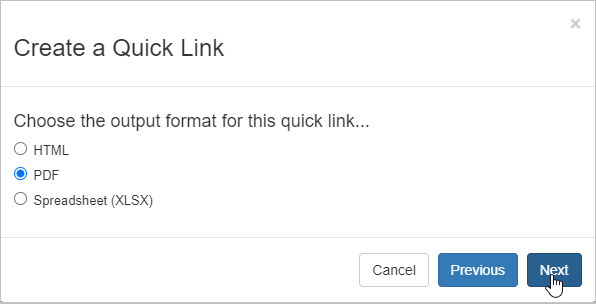
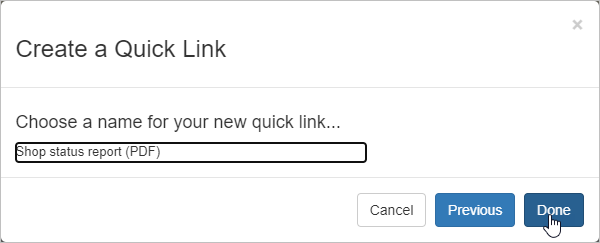
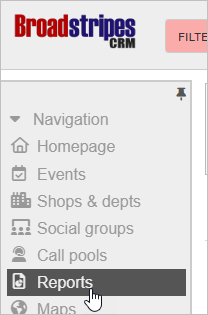
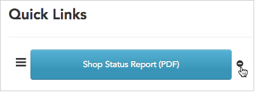

## Intro

Adding a **status report** to your quick links tab puts up-to-date aggregate counts just a click away. What's more, when you create the quick link, you can select how you want Broadstripes to present the reports: on-screen, or as PDF or Excel files that you can download and use offline.

Once your links are created, Broadstripes remembers your preferences. You'll see the data you need in the correct format – each time – with just the click of a button.

For this example, we want to add a quick link that shows us a status report for all our shops. We'll create the quick link based on a saved status report that's already in Broadstripes, and we'll choose to have the results exported to a PDF so we can print it and share it with others offline.

## Create a quick link for a status report

1. Start on the quick links tab and follow the steps outlined in the article [Create quick links](https://help.broadstripes.com/help-articles/using-broadstripes/customize/create-a-quick-link/) to begin.
2. Choose **a status report** as the type of link you want to add and click **Next**.
3. You'll see a list of all your saved status reports. Choose the report you want and click **Next**.
4. Choose the **output format** you want.

#### Choosing output formats

**View on-screen:**

- **HTML** – your report appears on-screen where you can view (but not edit) the data.

**Export and save:**

- **PDF** – report is exported as a PDF file (ideal for printing).
- **Spreadsheet (XLSX)** – report is exported as a Microsoft Excel spreadsheet file.

1. For our example, we'll choose **PDF**.
2. **Name** the quick link. This is the name that will appear on the quick link button on our dashboard, so we've noted that it's a PDF to help us remember. Click **Done** to save.
3. The new quick link now appears on our quick links tab.
4. Clicking the **Shop Status Report (PDF)** quick link button will generate the report.
5. To download and view your PDF, you have two choices:
    - you can **stay on the current page** and wait for the report's **download dialog**to appear.
    - you can **leave the current page** and **check in later** to see if the report is ready. To check for the report later, click the **Reports** link in the navigation panel. That link brings you to the **Requested Reports** page where you can download any requested report at any time.
        
        \[caption id="attachment\_25594" align="aligncenter" width="208"\] Click the **Reports** link in the navigation panel at any time to view a list of reports you've requested.\[/caption\]
        

1. Any quick link you create will remain on your **quick links tab** even after you've logged out and logged back in again.
2. If you ever need to **delete** a quick link, just click the  icon next to its name. Deleting the link will remove it from your tab, but it won’t delete the underlying saved report.
