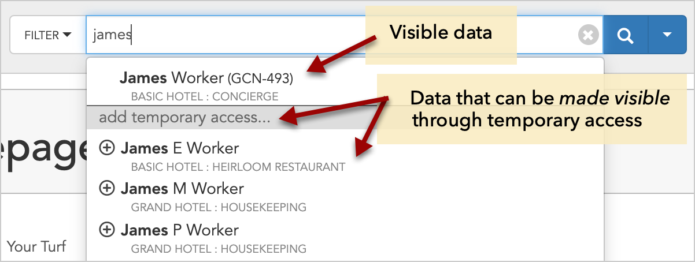
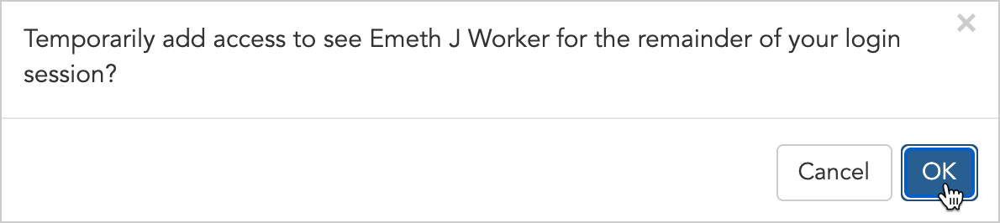
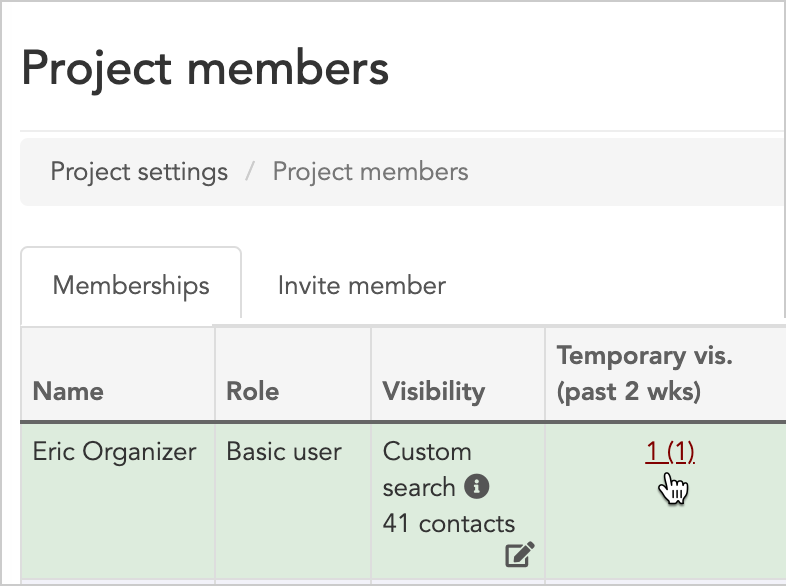
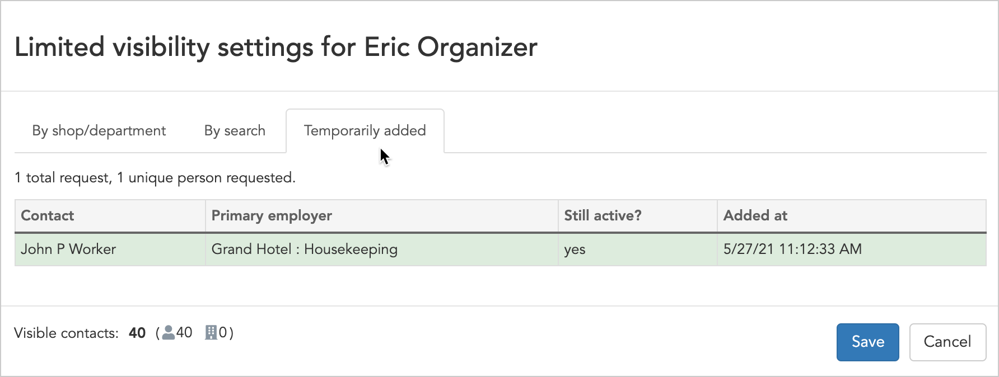

\[et\_pb\_section fb\_built="1" admin\_label="section" \_builder\_version="3.22" custom\_padding="0px|||||"\]\[et\_pb\_row admin\_label="row" \_builder\_version="3.25" background\_size="initial" background\_position="top\_left" background\_repeat="repeat" custom\_padding="0px|||||"\]\[et\_pb\_column type="4\_4" \_builder\_version="3.25" custom\_padding="|||" custom\_padding\_\_hover="|||"\]\[et\_pb\_text \_builder\_version="4.9.4" background\_size="initial" background\_position="top\_left" background\_repeat="repeat"\]

## Overview

In cases where users shouldn’t have full access to the project’s data, Broadstripes allows admins to control what data a basic user is able to see in a project with two optional features: "**Limited Visibility"** and "**Temporary visibility**." (You can learn how to enable both of these features in the [General settings article](https://help.broadstripes.com/help-articles/admin-tools/project-settings/general-settings/).)

With **limited visibility** enabled, basic users can only see the people and organizations you make [visible to them](https://help.broadstripes.com/help-articles/admin-tools/project-settings/limited-visibility/).

If you've already enabled limited visibility in your project, you'll also have the option of enabling **"Temporary visibility."** This feature will allow a **basic user** to search for a person that was not specifically made visible to them, and then **click to request access that person's full record**. Broadstripes will immediately allow that user to temporarily view the entire record with no restrictions for the remainder of their login session.

#### Temporary visibility at a glance

Allowing temporary visibility can be useful in situations where you want to give basic users with [limited visibility](/limited-visibility) a bit more control over the people they can see.

Keep in mind that admins will _not_ be asked to approve requests for temporary visibility – users will automatically see the full record for any contact they search for and request to access. The visibility will only last for the duration of their login session.

Broadstripes enables admins to keep track of who is using the temporary visibility feature and which contacts they are viewing by **logging** each temporary visibility request on the project member index page. Learn more on that [later in this article](#ftoc-heading-3).

## How a basic user requests temporary visibility

If a basic user runs a search and limited visibility and temporary visibility are both active on a project, they will see two types of search results – visible results, and results that are not visible, but can be made visible temporarily.

When the user clicks the name of the person who is not "visible" but they'd like to have access to, they'll be prompted to add temporary access. They simply click **OK** at the prompt and they'll immediately be able to see the contact record for the remainder of their login session.

This request will be logged and can be viewed by admins on the **project members** page for 14 days.

## View users' logged requests for temporary visibility

As **admin**, you can view all users' requests for temporary visibility. Here's how:

1. Click **Settings** > **Project members** in the upper right corner of any page.  
    
2. On the **project members index page,** go to the **"Temporary vis. (past 2 wks)"** column.  
    ****
3. You'll see the total **number of requests** made by the member in the last two weeks.
4. **Click** that **number** to see more detail. In the window that opens, you'll be able to see the **name** of the person who was viewed, their **employer**, the **date** the request was made and whether the session is still **active** (i.e. if the member can still view the person's record, or if their viewing session has ended).  
    ****
5. Click **Cancel** to leave this window and return to the project member index page.
6. **Repeat** this process to view requests by other members.

\[/et\_pb\_text\]\[/et\_pb\_column\]\[/et\_pb\_row\]\[/et\_pb\_section\]
