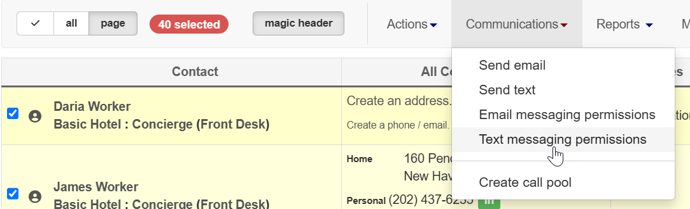

\[et\_pb\_section fb\_built="1" \_builder\_version="3.22"\]\[et\_pb\_row \_builder\_version="3.25" background\_size="initial" background\_position="top\_left" background\_repeat="repeat"\]\[et\_pb\_column type="4\_4" \_builder\_version="3.25" custom\_padding="|||" custom\_padding\_\_hover="|||"\]\[et\_pb\_text \_builder\_version="4.0.3"\]

## Overview

One of the most convenient features of Broadstripes messaging is that it allows you to send an SMS text to one or multiple workers at once. But first, each worker will need to provide a valid cell phone number and consent, or be "**Opted in**," to receive your text messages.

Learn all about **opting in** a cell phone and other aspects of Broadstripes text messages in this video, or read on for step-by-step instructions:

## Video: Text messaging with Broadstripes (including Opt in instructions)

\[/et\_pb\_text\]\[et\_pb\_text admin\_label="Set up and send text messaging" \_builder\_version="4.3.4" background\_enable\_image="off" background\_size="initial" background\_blend="overlay" custom\_margin="||20px||false|false" global\_module="23045" saved\_tabs="all" background\_\_hover\_enabled="on|desktop"\]

### Set up messaging and send a text blast

\[/et\_pb\_text\]\[et\_pb\_text \_builder\_version="4.0.3"\]

## Opt in cell phone numbers for text messaging

This article only covers one step in the process of sending text messages with Broadstripes – how to mark workers' cell phone numbers as **"Opted in."** Check out the full [Text messaging article](https://help.broadstripes.com/help-articles/using-broadstripes/working-with-search-results/text-messaging/) if you'd like to learn more about how to send SMS text messages using Broadstripes.

### Opt in a single worker's cell phone

1. From the **Search Results** page, hover over the   **looking glass icon** next to the worker's name.
2. Click in the Contact area to edit her phone information.
3. Click the **+Add phone/email button** to add a new phone number, or just begin typing to update an existing number.
4. Select **"Cell Phone"** as the phone type.
5. Choose the appropriate opted in reason under the **"Opted In"** drop-down menu.
6. Scroll down and click **Save**.  
    
7. The worker has now been opted in to receive SMS text messages using Broadstripes. Check out the full [Text messaging article](https://help.broadstripes.com/help-articles/using-broadstripes/working-with-search-results/text-messaging/) if you'd like to learn about how to send SMS text messages.

### Opt in multiple workers' cell phones at one time with a Bulk Action

1. Open a [tag list](https://help.broadstripes.com/help-articles/admin-tools/data-tools-admin/tag-lists/) or run a search to find all of the workers you want opted in. (If you need help running a search, check out the [Create and save a search](https://help.broadstripes.com/help-articles/using-broadstripes/customize/create-and-save-a-search/) article.)
2. [Select the workers](/help-articles/using-broadstripes/working-with-search-results/selecting-deselecting-contacts/#ftoc-heading-2) you want to mark "Opted In." For this example we'll select all 88 workers in our search results. 
3. Under **Actions**, choose “**Text Messaging Permissions.**”
4. Choose an opted in reason from the **"Opted In" drop-down** menu.
5. Click **Update** to save.
6. All of the selected workers have now been opted in to receive SMS text messages from Broadstripes. Check out the full [Text messaging article](https://help.broadstripes.com/help-articles/using-broadstripes/working-with-search-results/text-messaging/) if you'd like to learn about how to send SMS text messages.

\[/et\_pb\_text\]\[/et\_pb\_column\]\[/et\_pb\_row\]\[/et\_pb\_section\]
