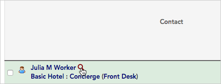
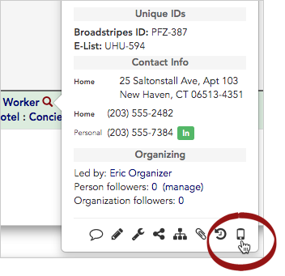
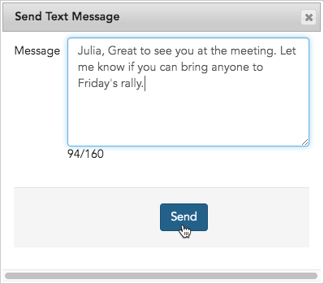

\[et\_pb\_section fb\_built="1" \_builder\_version="3.22"\]\[et\_pb\_row \_builder\_version="3.25" background\_size="initial" background\_position="top\_left" background\_repeat="repeat"\]\[et\_pb\_column type="4\_4" \_builder\_version="3.25" custom\_padding="|||" custom\_padding\_\_hover="|||"\]\[et\_pb\_text \_builder\_version="4.3.4"\]

## Overview

One of the most convenient features of Broadstripes messaging is that it allows you to send an SMS text to multiple workers at once, for instance, all the workers in a given shop or department, or everyone who has recently shown interest in coming to a rally you're planning. 

You can also send a message to just one worker at a time. Either way, you can receive responses back on your cell phone, and can view a history of all your text communications in Broadstripes.

Get a look at how Broadstripes text messaging works in this overview video, or scroll down to watch a step-by-step video and learn how to get set up to send your first text blast.

## Video: Overview - How text messaging works in Broadstripes

\[/et\_pb\_text\]\[et\_pb\_text admin\_label="SMS text messaging overview video" \_builder\_version="4.3.4" global\_module="23332" saved\_tabs="all"\]

### Overview of SMS text messaging

\[/et\_pb\_text\]\[et\_pb\_text \_builder\_version="4.3.4"\]

## Video: How to set up and use text messaging in Broadstripes

\[/et\_pb\_text\]\[et\_pb\_text admin\_label="Set up and send text messaging" \_builder\_version="4.3.4" background\_enable\_image="off" background\_size="initial" background\_blend="overlay" custom\_margin="||20px||false|false" global\_module="23045" saved\_tabs="all" background\_\_hover\_enabled="on|desktop"\]

### Set up messaging and send a text blast

\[/et\_pb\_text\]\[et\_pb\_text \_builder\_version="4.4.8"\]

## Before you can send a text message

Three things need to happen before you start sending texts in Broadstripes:

1. You have to have **permission to send texts**, which an admin can give you.
2. You need a **virtual cell number**, which also must be provided by an admin. Broadstripes uses virtual numbers so that:
    - organizers don’t have to give out their real cell numbers
    - if an organizer moves on from a campaign, another team member can continue an ongoing text conversation in their place.
3. You need to **add your own (real) cell number to your Broadstripes user account** so that Broadstripes can notify you if someone you text sends a message back.

### How to add your cell number to your user account

For this example, let’s say that you have the permission you need and an admin has set up a virtual number for you.

Your next step is to add your **actual cell number** to your **user account**. Keep in mind that this number won’t be visible to the workers you text – they’ll receive texts from your virtual number. But you do need to include your real number on your account so that you receive notification texts on your cell if a worker replies to you.

Here’s how to add your number:

1. To start, **click on your name** in the upper right-hand corner of the page to open your **account details**.
2. When the **account details** form opens, type your cell number into the **Phone number for SMS notifications** field.
3. Click **Update Info** to save.
4. You’re now all set up to send text messages.

## Sending a text message to multiple workers at once

From the search results page, you can easily send an SMS text to multiple workers using a bulk action.

Learn how step-by-step in the [Bulk Actions - Send SMS texts](https://help.broadstripes.com/help-articles/using-broadstripes/working-with-search-results/bulk-actions-send-sms-text-message/) article.

## Sending a text to a single worker

You can also send a text to just one worker. You can use the method above (selecting only their name from the search results), or you can use a shortcut on their contact detail pop-up window:

1. From the **Search Results** page, hover over the   **looking glass icon** next to the worker's name.
2. Click the **phone icon** shortcut at the bottom of the pop-up window.
3. Compose a short message (160 characters or fewer) and hit **Send.**

## Receiving replies to your texts

Now let’s look at what happens if a worker **writes back to a text** you’ve sent using Broadstripes.

1. If someone **replies to a text** you've sent, you’ll get a **text notification** on your cell phone with the **name of the project**, the **name of the** **worker** who responded and a **snippet** of their message.
2. At the bottom of the **notification text**, there’ll be a **link** that takes you to the full text conversation in your **phone’s browser**.
3. **Tap the link** and **log in** to Broadstripes if you’re prompted.
4. The **browser display** that opens will look just like a regular text conversation and will allow you to continue your conversation using your Broadstripes virtual number. You’ll be able to **send** and **see messages** as they arrive in real time.

## See a history of sent texts in Broadstripes

Seeing a **history** of the texts you've sent in bulk can be helpful for tracking and managing your communications. You'll also be able to see messages sent by others on your team. Here's how to view that history using Broadstripes:

1. Choose **Sent texts** from the left-hand **toolbar**.
2. You'll see a **list** of every **bulk text** sent out for this project. Click the  **info icon** to see more details about a specific text.

\[/et\_pb\_text\]\[/et\_pb\_column\]\[/et\_pb\_row\]\[/et\_pb\_section\]
