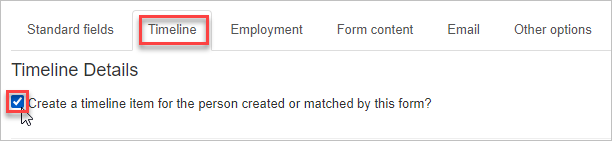

## Should your form create a timeline item?

\[caption id="attachment\_25539" align="alignright" width="300"\] _Photo by Anete Lusina_\[/caption\]

You might be creating a form to give your organizers an easy way to record a particular organizing event — a meeting, a one-on-one conversation, a card-signing, etc.

For example, unions have used Broadstripes public forms to enable organizers (many of whom did not have Broadstripes user accounts and had no access to the app itself) to immediately record debrief notes on organizing conversations that were conducted in the field.

In that case, you might want the form to create a new timeline item for the person it creates or updates. The options on the **Timeline tab** enable your form to do that.

Your choices on this tab will determine the timeline type of the new item, and will allow the form submitter to enter the other details of the item.

**IMPORTANT NOTE:** On the **Other fields** tab, you have the option to make the form automatically check any event step in your project when it's submitted. If you use this option, and the event step you choose is "timeline-tracked," submission of the form will automatically create an almost-empty timeline item (when the event step is checked).

## Customize your form to include timeline item details

In this example, our public form is being used by an organizer to capture notes during or after a house visit to a worker. Here's how:

1. From the public form editor, select the **Timeline** **tab**.
2. Check the box labeled**"Create a timeline item for the person created or matched by this form?"** This will allow the form submission to automatically create a timeline entry for the person when the form is submitted. ****
3. Choose the type of timeline item to be created. This typically reflects the type of interaction or event that occurred, e.g., " One-on-One," "phone call," "Meeting," or "House Visit."
4. Check the timeline fields you want to include in the form. While none of these fields are mandatory (unless you mark them as required using the **Selected Fields** panel), including at least one is recommended. Without timeline information, the value of the timeline item may be limited.
5. **An important note about the "Contacted by" field:** If you want the form submitter to indicate who made contact, check the box next to "Contacted by."  Broadstripes will try to match this contact information (cell phone number or email) to an existing person in the app. You should relabel this field with a meaningful custom label, like **"Organizer Phone"** or **"Phone of Contacting Person"**.
6. You can create custom labels for any timeline fields on the form. If you leave the **Custom label on form** field blank, Broadstripes will use generic labels for the fields ("Occurred on", "Occurred at", "Contacted by", "Assessment", and "Notes"). If you enter any text in that field, it will be used to label the form field in place of the default value.

You can **save** or move on to the next tab to finish customizing your public form.

- [Create a new contact type](https://help.broadstripes.com/help-articles/admin-tools/public-forms/first-step/) 
- [The "Standard fields" tab](https://help.broadstripes.com/help-articles/admin-tools/public-forms/standard-fields-tab-in-public-form/)
- [The "Employment" tab](https://help.broadstripes.com/help-articles/admin-tools/public-forms/employment-tab/)
- [The "Form content" tab](https://help.broadstripes.com/help-articles/admin-tools/public-forms/form-content-tab/)
- [The "Email" tab](https://help.broadstripes.com/help-articles/admin-tools/public-forms/email-tab/)
- [The "Other options" tab](https://help.broadstripes.com/help-articles/admin-tools/public-forms/other-options-tab/)
- [Viewing and Downloading public forms](https://help.broadstripes.com/help-articles/admin-tools/public-forms/viewing-and-downloading-public-forms/)
