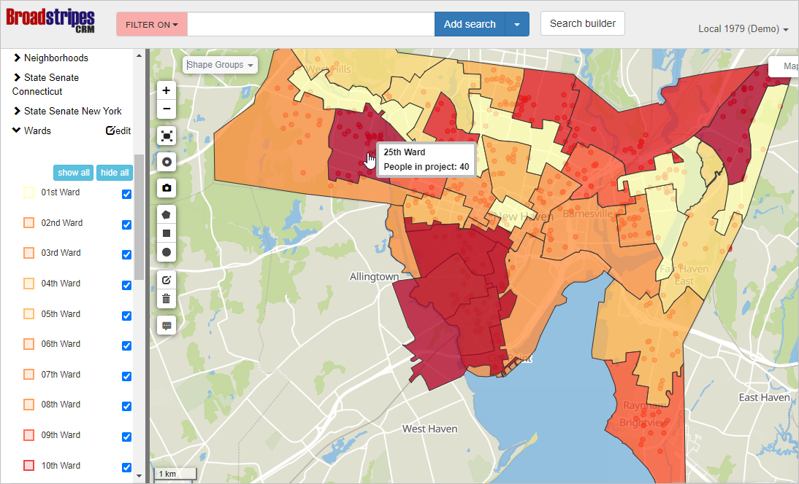
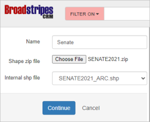
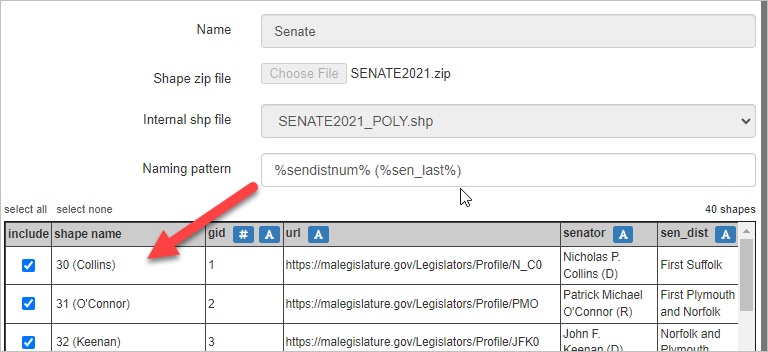

Shapefiles are predefined geographic shapes that delineate key areas within a specified region. They are valuable tools for identifying geographic entities such as legislative boundaries, districts, and neighborhoods. Utilizing shapefiles in projects can provide essential geographical context. These files can be easily imported into Broadstripesas visual aids.

To acquire shapefiles, one can typically download them in ZIP format from a state government's website. Alternatively, a simple Google search for a specific shapefile can lead to resources for obtaining the desired files. In this article, we will explore the process of uploading a shapefile into a project directly from a zip file.

Once you've obtained the shapefile in ZIP format, follow these steps:

1. 1. Click the **Settings** link in the upper right corner of the screen, and choose **All Settings**. When the **Project Settings** page opens, click **Upload shape file** in the Maps section in the right-hand column.  
    2. In the **Name** field, type a name for the "shape group" that will be created to hold these shapes. The best names are clear and concise and contain few or no spaces, as they will become search terms. In this case, we will use "Senate".
    3. Click the **Choose file** button, and locate and select the ZIP file you downloaded on your computer.
    4. Once the file has been uploaded, choose a **.SHP** file from the **Internal SHP file** dropdown menu. _**Note:** often, there will be only one .SHP file in a ZIP. If there is more than one, you will have to try to identify the one you want. The name should offer some hints. If one filename suggests that it contains "lines" and another, "polygons," you should choose polygons. If you choose incorrectly, you can cancel and restart the process.)._ 
    5. Once the file has been processed, you should see the shapes represented on a map on the right side of the page and a grid presenting the "metadata" contained in the file for each shape. Now, you need to design the "naming pattern" for your shapes. Here are some suggestions about how to do that:
        - Look at the data in the grid and determine which columns should be included in each shape's name.
        - If you're creating political district shapes, you may be able to include both the district number and the name of the current elected official in the shape name.
        - Look carefully at **all** the data — sometimes numbered district files also include a "GID" (global identifier) that is different than the district number. It's easy to confuse the two and create shapes that are numbered incorrectly. Also, sometimes, a shapefile may contain many columns of metadata. Be sure to scroll horizontally to make sure you see all columns.
        - To include the data from a column in the naming pattern, click on the  #  or  A icon in the header of that column. The # icon will include "leading zeros" in front of a numeric value (e.g. the district number), which will allow the shapes to alphabetize properly. The A icon simply includes the text from the column without making any changes.
        - We recommend avoiding including the "type" of the shape (e.g., "ward," "district," "county") in its naming pattern. It's repetitive and unnecessarily complicates searching for the shape without providing additional information.
        - As you change the naming pattern, the "shape name" column will be updated to show you the way that pattern will determine the name for each shape. Examining this is very useful for avoiding mistakes.
        - **Don't worry** — if you make a mistake, you can delete the shape group and start again.
    6. You may also choose to exclude certain shapes from the upload. Uncheck the shapes that you do not need in the **include** column.
    7. If you are happy with the preview and shape names, Click **Save** at the bottom of the left-hand panel. It may take a few minutes for your shapes to be generated and for all records to be correctly indexed.

If you attempt to search by shape within 10-15 minutes after saving the shape group, the results may not be entirely accurate. Therefore, we advise to give it a little time before conducting searches.
