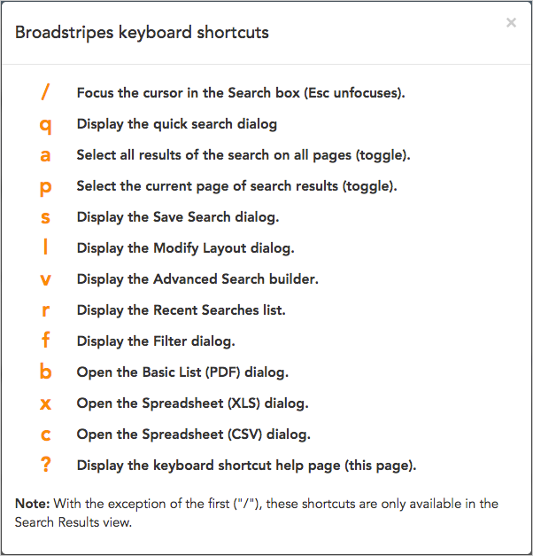

\[et\_pb\_section fb\_built="1" \_builder\_version="3.22"\]\[et\_pb\_row \_builder\_version="3.25"\]\[et\_pb\_column type="4\_4" \_builder\_version="3.25" custom\_padding="|||" custom\_padding\_\_hover="|||"\]\[et\_pb\_text \_builder\_version="3.27.4"\]

## Navigate your search results without a mouse

Broadstripes search comes with a set of keyboard shortcuts making your work even more efficient.

These shortcuts are only available while you're in Broadstripes' **Search Results view**. The exception is the **" / " shortcut**, which works from any view and places your cursor into the search box where you can type a search query.

Using the shortcuts couldn't be more simple. Just type the keyboard shortcut letter or character and Broadstripes will take the corresponding action (for instance, type the letter **q** and the **quick search dialog box** will open).

If you ever want to see a list of these shortcuts without leaving the Broadstripes app, just type **?** and the complete list of shortcuts will display on-screen.

Here's a full list of the shortcuts and what they do:

\[/et\_pb\_text\]\[/et\_pb\_column\]\[/et\_pb\_row\]\[/et\_pb\_section\]
