\[et\_pb\_section fb\_built="1" admin\_label="section" \_builder\_version="4.16" global\_colors\_info="{}"\]\[et\_pb\_row admin\_label="row" \_builder\_version="4.16" background\_size="initial" background\_position="top\_left" background\_repeat="repeat" global\_colors\_info="{}"\]\[et\_pb\_column type="4\_4" \_builder\_version="4.16" custom\_padding="|||" global\_colors\_info="{}" custom\_padding\_\_hover="|||"\]\[et\_pb\_text \_builder\_version="4.19.4" hover\_enabled="0" global\_colors\_info="{}" sticky\_enabled="0"\]

## Homepage overview

Your Broadstripes homepage gives you customized, at-a-glance insight into your project. Open your homepage by either clicking the **Broadstripes** logo at the top left corner of any page, or the **Homepage** link in the left-hand navigational toolbar.

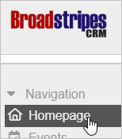

## Your homepage tabs

Once you’re on your homepage, you’ll see your project’s most important information separated into five tabs.

[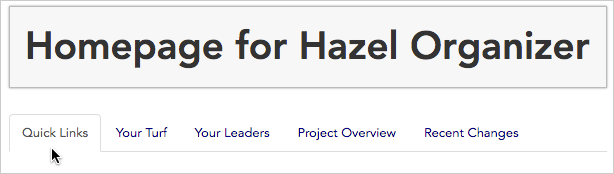](https://help.broadstripes.com/wp-content/uploads/2018/03/fd07e9a-HomepageTabsQL-3.png)

## Quick Links

The **Quick Links** tab is a customizable page where your most frequent searches or reports are just one click away.

This means that with quick links, you have a single point of access for the things you use most. Quick links are also fully customizable, so you can add and remove links from your quick links tab to meet your changing work demands. (Learn more about customizing quick links – including choosing output formats – in the [Create quick links](https://help.broadstripes.com/help-articles/using-broadstripes/customize/create-a-quick-link/) article.)

Many users start at the **Quick Links tab** to easily jump to the tasks they do each day, including:

- opening data entry views
- generating PDF lists
- generating aggregated status reports
- running your most frequent searches

[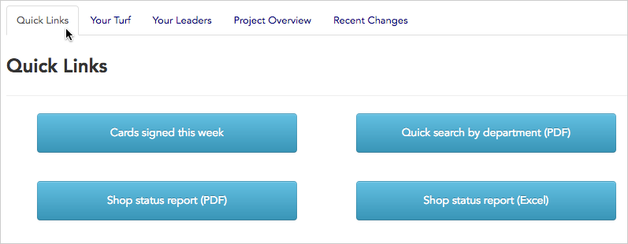](https://help.broadstripes.com/wp-content/uploads/2018/03/3c4e358-HomepageQL-3.png)

### How to use your Quick Links

Here’s how to use quick links to manage common tasks:  
1\. Click the **homepage** link in the navigational panel.

2\. Go to the **Quick Links** tab.

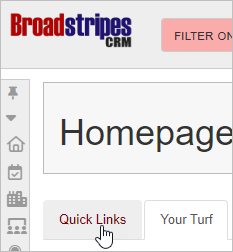

3\. All of your quick links will be displayed on the tab as buttons.  
4\. Here’s a look at what each of the four **buttons** shown below will do. (**Note**: since quick links are set up by you or your admin to match your specific workflow, the links you see will be different than those shown below.)

[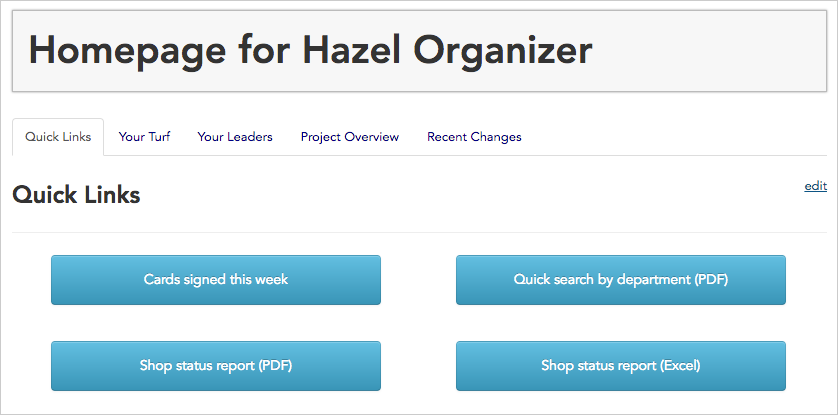](https://help.broadstripes.com/wp-content/uploads/2018/03/46e363f-UseQLtab-3.png)

5. **Launch a search:** Clicking the button **Cards signed this week**, takes us immediately to a search results data view panel where we can view or update records.

\[caption id="" align="aligncenter" width="369"\] Clicking this button launches the search below.\[/caption\]

[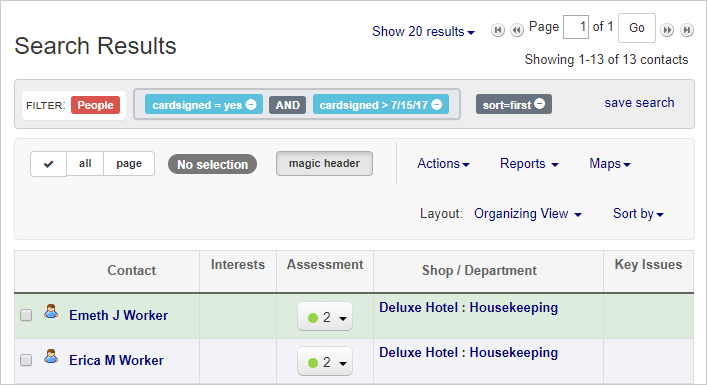](https://help.broadstripes.com/wp-content/uploads/2018/03/d0fa493-quick_links_image_1-3.png)

6. **Download a PDF:** Clicking the button **Quick search by department** launches a dynamic search that then automatically generates a PDF with all the worker details we need.

\[caption id="" align="aligncenter" width="304"\] Clicking this button opens the search below, and then generates a downloadable PDF.\[/caption\]

[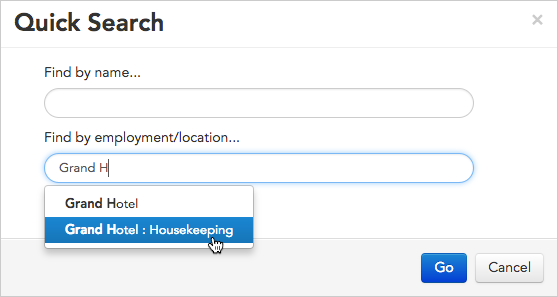](https://help.broadstripes.com/wp-content/uploads/2018/03/f8d63e8-QLQuickChooseDept-3.png)

[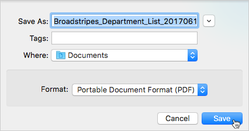](https://help.broadstripes.com/wp-content/uploads/2018/03/ffc572f-QLQuickDownload-3.png)

7. **Download an Excel report:** Clicking the button **Shop status report (Excel)** generates a fully-updated status report that we can download and manipulate offline with Excel – all with just the click of a button.

\[caption id="" align="aligncenter" width="364"\] Clicking this button generates an Excel report like the one shown below.\[/caption\]

[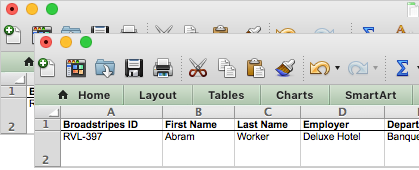](https://help.broadstripes.com/wp-content/uploads/2018/03/96c797a-UseQLExcel-3.png)

## Your Turf

**Your Turf** tab presents a dashboard of the workers you organize by their location.

It also offers key metrics about them – like distribution of assessments or number and percentage of cards signed – and provides links to members of your leadership teams.

Just click to launch any of your custom reports right from your turf tab.

### Set up Your Turf

**Your Turf** tab shows you a summary view of the shops you are responsible for organizing and allows you to keep track of what’s going on at other shops as well.

Here’s how to read your turf tab:

1. Below is a sample view of an organizer’s turf tab.
2. As you can see, it shows links to this organizer’s custom reports on the top of the page and displays information about the locations she organizes (“**Basic Hotel**” and “**Deluxe Hotel**) on the lower half of the page.

[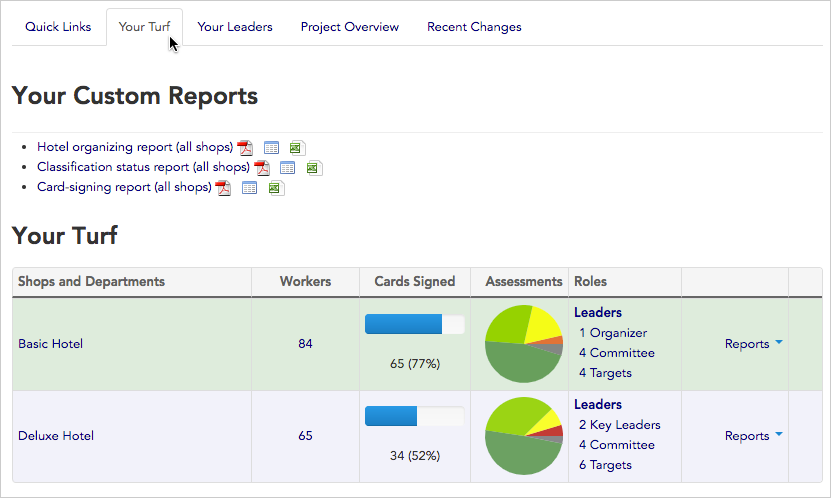](https://help.broadstripes.com/wp-content/uploads/2018/03/c6e02ca-HomepageYT-3.png)

1. All this information displays automatically – if this organizer was the organizer of another shop, the turf tab would display that shop, too.
2. Your turf tab is a powerful tool for accessing the data that’s most important to you. From your turf tab, you can easily jump to more detailed information as it’s needed.
3. Clicking the **Basic Hotel** link, for instance, will open the hotel’s overview page where Broadstripes displays a vast amount of additional information (for instance, all of the Basic Hotel’s child organizations and its workers’ assessment history).  
      
    

\[caption id="" align="aligncenter" width="198"\][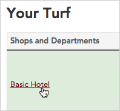](https://help.broadstripes.com/wp-content/uploads/2018/03/18ef864-TurfTabHotel-3.png) You can click a location to open a detailed overview.\[/caption\]

\[caption id="" align="aligncenter" width="673"\][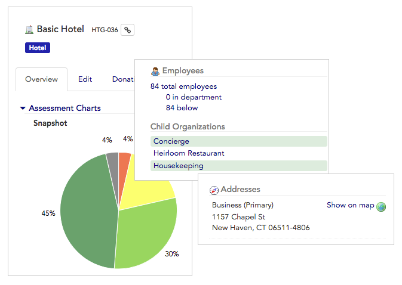](https://help.broadstripes.com/wp-content/uploads/2018/03/2b100e8-TurfEmplOverviewTabMag3-3.png) Overview of Basic Hotel.\[/caption\]

1. You can drill down into information wherever you see a hyperlink. For instance, clicking on the number “84” in the **Workers** column will open a detailed list showing all 84 workers at the Basic Hotel.

\[caption id="" align="aligncenter" width="322"\][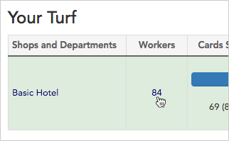](https://help.broadstripes.com/wp-content/uploads/2018/03/6155965-YourTurfWorkers-3.png) Clicking this link will show a list of every worker at Basic Hotel.\[/caption\]

\[caption id="" align="aligncenter" width="541"\][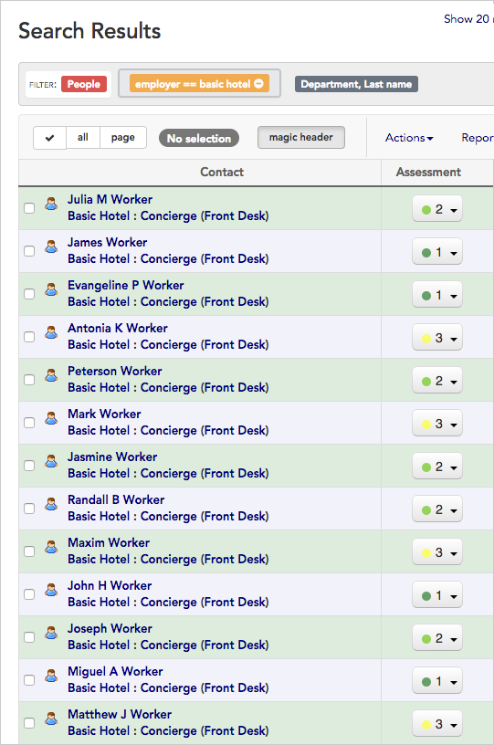](https://help.broadstripes.com/wp-content/uploads/2018/03/3c710c0-TurfWorkersListDetail-3.png) A list of workers for the Basic Hotel.\[/caption\]

1. Similarly, you can **hover over** the links on your turf tab to see detailed information without navigating away from the turf page.
2. Hovering over a segment of the **Assessments pie chart** will show the total number of workers who have been assessed with that code (for instance, in the example below, 39 workers have an assessment of “**1**” and 23 have an assessment of “**2**“).  
      
    

\[caption id="" align="aligncenter" width="292"\][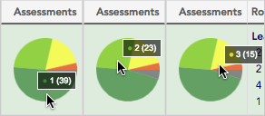](https://help.broadstripes.com/wp-content/uploads/2018/03/885a5a9-TurfTabHoverAssess123-3.png) Hover over each of the Assessments pie segments to see how many workers each slice represents.\[/caption\]

### View a location you don’t lead

This organizer’s turf tab can also be set up to display information about “**Grand Hotel**,” a shop for which her colleague is responsible.

She can add a shop, or one of its departments–for instance, “Banquets”– to her turf page if she is interested in keeping an eye on how things were going there.

Here’s how:

1. Click the **\+ Add shops and departments you don’t lead…** button at the bottom of the page.  
      
    
    [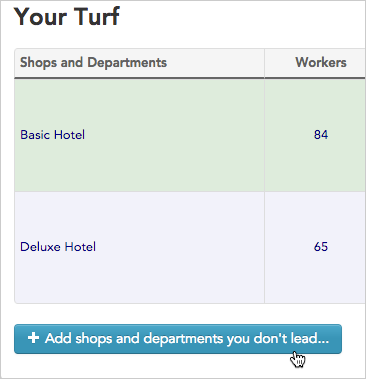](https://help.broadstripes.com/wp-content/uploads/2018/03/1848ed5-TurfTabaddshops-1.png)
    

1. **Type the name** of the shop or department to include.

[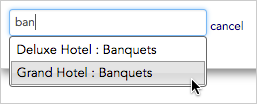](https://help.broadstripes.com/wp-content/uploads/2018/03/9992228-TurfTabAddBanquets-1.png)

## Your Leaders

**Your Leaders** tab presents an easy-to-navigate list of your senior leaders.

From this tab, you can see how many people or organizations each leader is in charge of, or click the hyperlinks in the **Name**, **People**, or **Orgs** columns to see more details. From this tab, you can also download a PDF report to view or share this detailed data off-line.

[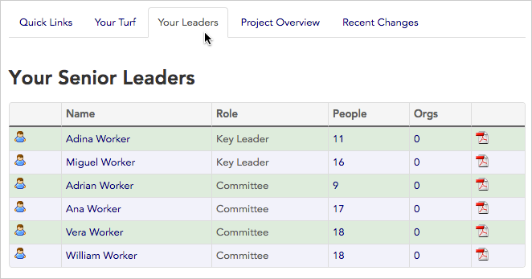](https://help.broadstripes.com/wp-content/uploads/2018/03/e31ca86-HomepageYL-1.png)

## Project Overview

The **Project Overview** tab offers a broad assessment of your project.

Like the turf tab, it provides quick links to all of your custom reports, and it also gives you a snapshot of your current assessments and the assessment trends over time.

At the bottom of the page, you can see key statistics about your project – like the total number of Broadstripes users and how many organizations and people it contains – as well as personal statistics like the date of your last login.

Like other tabs on your homepage, most of the numbers presented are clickable links that let you drill down to detailed information where you need it.

[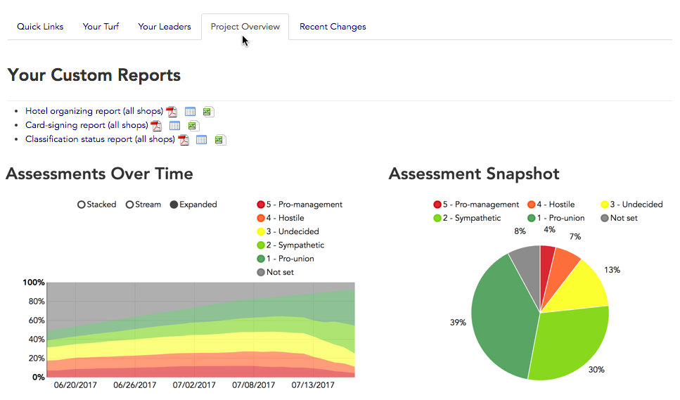](https://help.broadstripes.com/wp-content/uploads/2018/03/8ce5568-HomepagePO-1.png)

## Recent Changes

**Recent Changes** tab shows the last 25 contact records (both organizations and people) to be updated across your entire project.

You’ll also see the name of the Broadstripes user who edited the record and the exact time the change was made.

[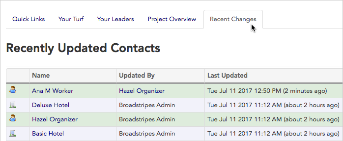](https://help.broadstripes.com/wp-content/uploads/2018/03/4e19349-HomepageRC-1.png)

\[/et\_pb\_text\]\[/et\_pb\_column\]\[/et\_pb\_row\]\[/et\_pb\_section\]
