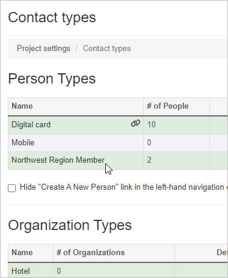
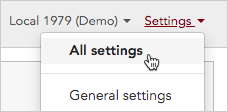
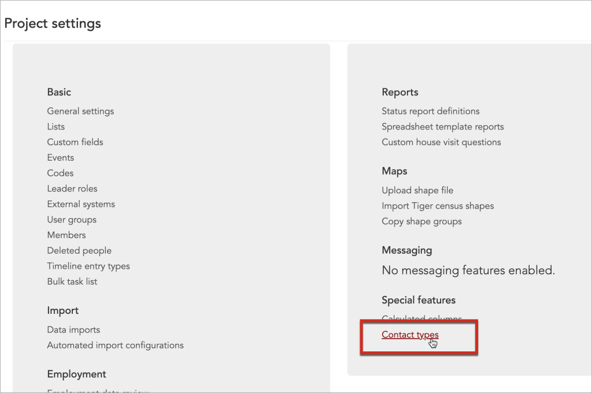
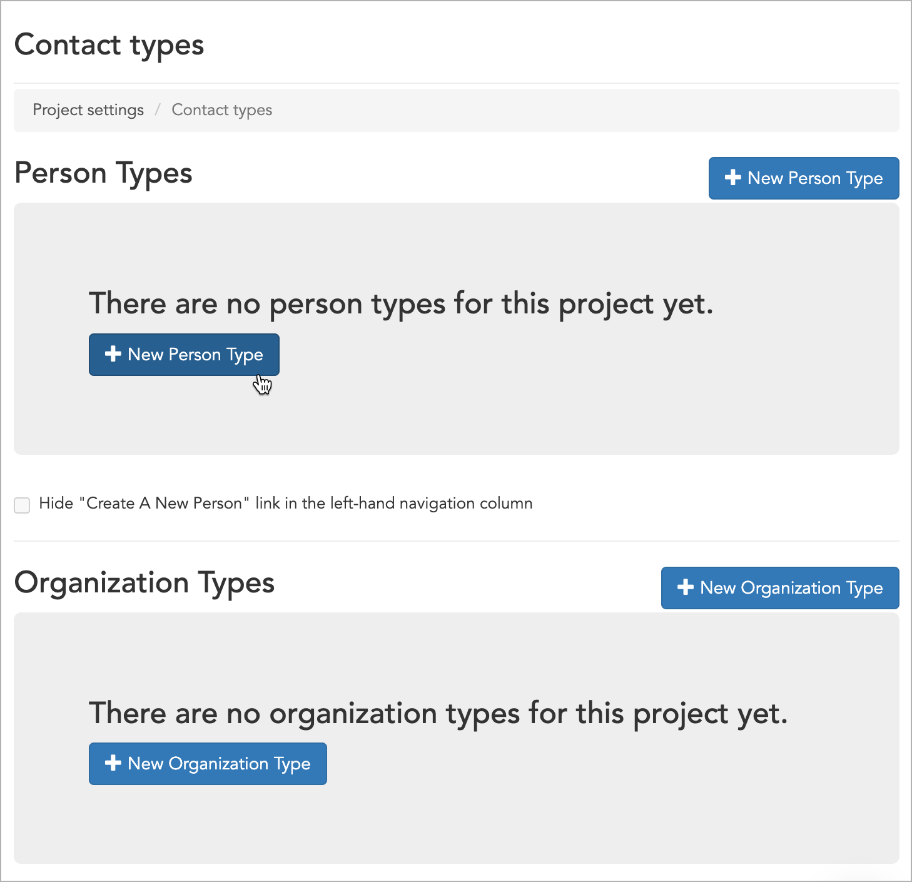
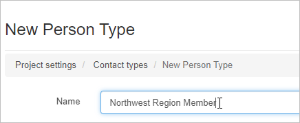
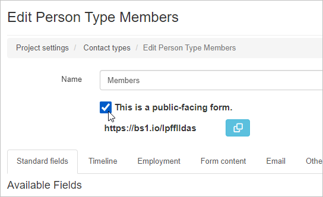
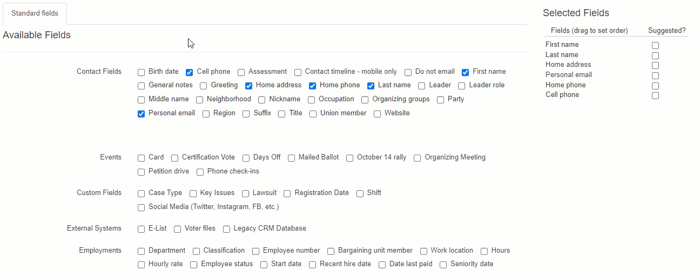

Broadstripes, by default, gives you two different ways of defining a record, an organization, or a person. You may make subcategories or additional contact types for either a person or an organization. ( e.g., Northwest Region Member under a person contact type) The contact type that you choose for a record will determine what data can be stored. There are certain custom fields that are only applicable to a person and others to organizations. You will determine which works best for your project. 

Contact types are also used to create **public forms.** 

## Create a new contact type

To create a contact type or a public form, you must be an admin in your project. As with most admin-only functionality, Broadstripes' **Contact types** page is accessible via the Settings dropdown in the upper right corner of your screen.

1. Click **Settings** and then choose **All settings** to open the **Project settings** page. 
2. On the **Project settings** page, go to the **Special features** section and select **Contact types.**Your **Project settings** page may look slightly different depending on the features you have enabled for your project. 
3. On the **Contact types** page, click the **New Person Type**. (If you were creating a form to create or update an organization, you would, of course, click **New Organization Type**. As mentioned above, most forms are set up to create or update person records, so that's what we'll be describing here.) 
4. On the **New Person Type** page, create a name for the new contact type. 
5. You may convert a contact type into a Public form by checking the "**This is a public-facing form.**" checkbox. For additional instructions on Public forms, click [here](https://help.broadstripes.com/help-articles/admin-tools/public-forms/first-step/#publicformanchor). 
6. Select the fields you want to associate with your new contact type.
    
    \[caption id="attachment\_25869" align="aligncenter" width="1296"\] Drag and drop the Selected Fields on the right to change the order in which the fields appear on the record's edit page.\[/caption\]
