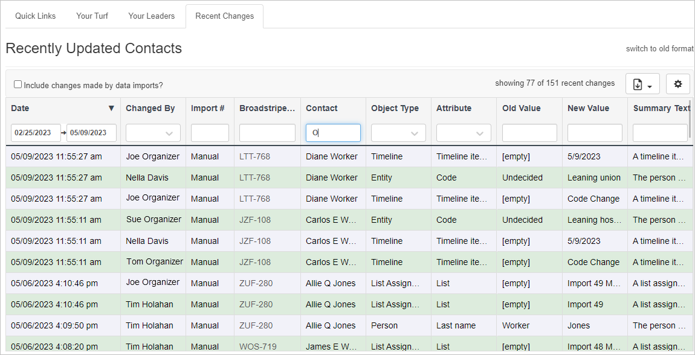
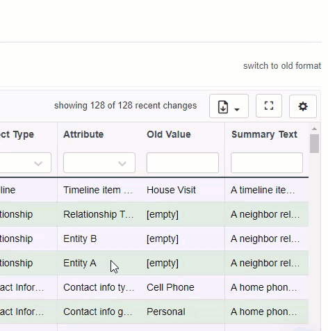
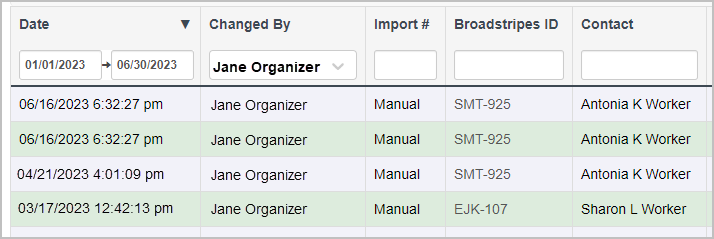
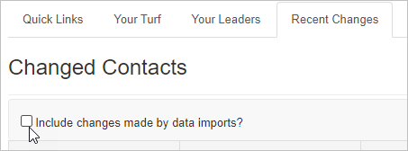
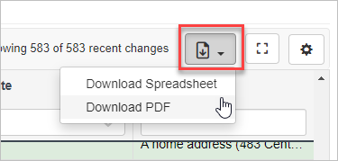
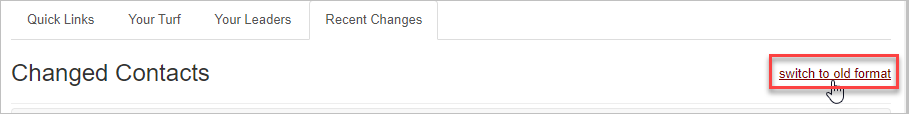
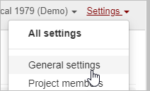
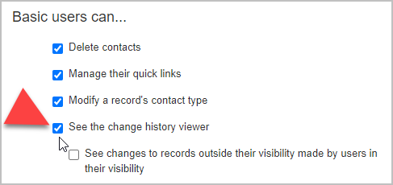

# Overview

The **Change explorer** on the **Recent Changes** tab gives a more effective level of detail about changes that have occurred in your project. Change explorer gives you all the details to identify how, when, and by whom changes were made throughout your project.

 

Filterable columns include:

- **Date**
- the user or entity the item was **Changed By**
- the **Import #** (the import ID of the data import that modified the contact) if applicable
- the contact's **Broadstripes ID**
- the **Contact** name
- the **Object Type** (the data field that was modified e.g., Address, Contact Information, Employment, etc.)
- **Attribute** that was changed
- the attribute's **Old Value**
- the attribute's **New Value**
- a brief **Summary Text** of the change that occurred

### Selecting your columns

Change explorer gives users a variety of information for each change. You can choose what values/columns you want to view in your Change explorer by selecting the gear icon just above your Change explorer columns. Uncheck any columns that you don't want to hide, and they will be removed from your view. 

### Filtering for relevant changes

At the top of each column, you may enter values to filter the change data that is returned. Changes can go back as far as the beginning of the project and could mean tons of data to review. To narrow down this data, enter the specific values that you are looking for. For example, if you wanted to view changes made by Jane Organizer within the first half of 2023, you would:

1. Enter the values 01/01/2023 -> 06/30/2023 in the **Date** column.
2. Select Jane Organizer from the dropdown menu in the **Changed By** column.
3. Click **"Run my new query."** 

### Including data import changes

Changes occur from a variety of sources, including users, Public forms, and data imports. Data imports can generate an extensive amount of changes. To view those changes in your Change explorer results, click the "Include changes made by data imports?" checkbox in the upper left corner of the Recent Changes tab. 

### Downloading Change explorer results

Users can download the Change explorer to a spreadsheet or PDF.  You will download the data as you see it in Change explorer. This will include your filtering specifications and column selections. To download your Change explorer results, click on the paper download icon (see below) in the right corner above the columns. Select "Download Spreadsheet" or "Download PDF."  Your data will be generated in the format that you specified.

Switching to the older format

As a project admin, you automatically have the **Change explorer** enabled. If you prefer a less detailed view, you can click on **"switch to old format"** in the upper right corner of the **Recent Changes** tab. This will take you to the previous format with 3 fixed columns (Name, Updated By, and Last Updated) that will display the last 25 changes.

If you decide that you want to go back to a more detailed view of changes, simply select "switch to new format" in the upper right corner of the **Recent Changes** tab.

### Enabling Change explorer for basic users

Project admins can also enable the Change explorer for basic users. Here's how:

1. Click on **Settings** at the top right corner of the app. Then select **General settings** from the dropdown menu. 
2. Click the checkbox labeled ****"See the change history viewer" **** For projects that have Limited visibility enabled, admins can allow basic users to see changes made to contacts outside of their visibility if the user that made the change is within their visibility by selecting the checkbox directly beneath "See change history viewer."
3. Click the **"Save project"** button.

Basic users may now view the Change explorer in their Recent Changes tab on the homepage.
