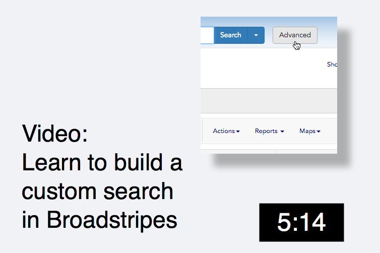

\[et\_pb\_section fb\_built="1" \_builder\_version="3.22" fb\_built="1" \_i="0" \_address="0"\]\[et\_pb\_row \_builder\_version="3.25" background\_size="initial" background\_position="top\_left" background\_repeat="repeat" \_i="0" \_address="0.0"\]\[et\_pb\_column type="4\_4" \_builder\_version="3.25" custom\_padding="|||" \_i="0" \_address="0.0.0" custom\_padding\_\_hover="|||"\]\[et\_pb\_text admin\_label="Text" \_builder\_version="3.27.4" \_i="0" \_address="0.0.0.0"\]

# Video: How to build a search with the search builder

You can also read more about building custom searches in the [Build an advanced search](https://help.broadstripes.com/help-articles/using-broadstripes/search/build-an-advanced-search/) or [Add rule groups to your search](https://help.broadstripes.com/help-articles/using-broadstripes/search/add-rule-groups-to-your-search/) help articles.

\[/et\_pb\_text\]\[et\_pb\_video src="https://vimeo.com/322305306" image\_src="https://help.broadstripes.com/wp-content/uploads/2018/11/BuildAdvancedSearchSlide.png" play\_icon\_color="#e0ac00" thumbnail\_overlay\_color="rgba(0,0,0,0.6)" admin\_label="Video How to Build a Search with the search Builder" \_builder\_version="3.27.4" box\_shadow\_style="preset2" disabled="on" global\_module="21759" saved\_tabs="all" \_i="0" \_address="2.1.3.0.0"\]

\[/et\_pb\_video\]\[et\_pb\_text admin\_label="How to Build a Search with the Search Builder" \_builder\_version="3.27.4" custom\_margin="||||false|false" \_i="2" \_address="0.0.0.2"\]

### Build custom searches

\[/et\_pb\_text\]\[/et\_pb\_column\]\[/et\_pb\_row\]\[/et\_pb\_section\]
